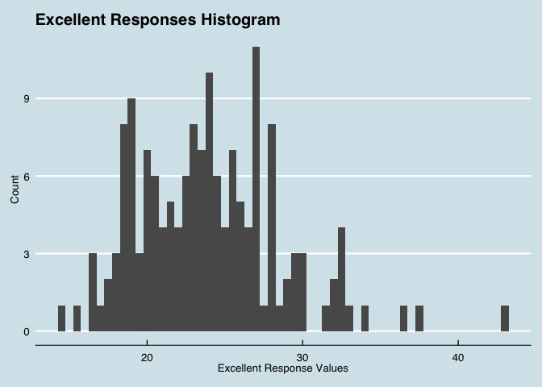
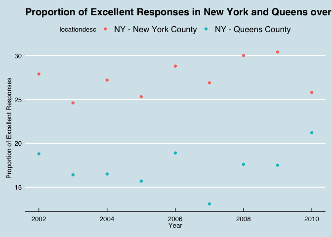

HW2\_cs3652
================

GitHub Documents
----------------

This is an R Markdown format used for publishing markdown documents to GitHub. When you click the **Knit** button all R code chunks are run and a markdown file (.md) suitable for publishing to GitHub is generated.

``` r
library(tidyverse)
```

    ## ── Attaching packages ────────────────────────────────────────────────────────── tidyverse 1.2.1 ──

    ## ✔ ggplot2 3.0.0     ✔ purrr   0.2.5
    ## ✔ tibble  1.4.2     ✔ dplyr   0.7.6
    ## ✔ tidyr   0.8.1     ✔ stringr 1.3.1
    ## ✔ readr   1.1.1     ✔ forcats 0.3.0

    ## ── Conflicts ───────────────────────────────────────────────────────────── tidyverse_conflicts() ──
    ## ✖ dplyr::filter() masks stats::filter()
    ## ✖ dplyr::lag()    masks stats::lag()

Problem 1
---------

``` r
subway_data = read_csv(file = "./NYC_Transit_Subway_Entrance_And_Exit_Data.csv", col_types = "cccddcccccccccccccccccccccccddcc") %>%
  janitor::clean_names() %>% 
  ##cleaning names so that they are lowercase snake
  select(line, station_name, station_latitude, station_longitude, route1:route11, entry, vending, entrance_type, ada) %>% 
  ##selecting relevant variables
  mutate(entry = recode(entry, 'YES' = TRUE, 'NO' = FALSE))
  ##recoding to logical variable 
```

This dataset has many variables that describe the MTA service at New York City subway stations. It includes the routes that each station serves, as well as entry/exit points, and ada compliance, among many other things. Thus far, the data cleaning steps that I have taken so far are: cleaning the names so that they are easy to read and are lower case snake, selecting the columns (variables) that are relevant to our analysis, and mutating the entry variable so that it is a logical variable. The dimension of the resulting dataset is 1868, 19 (that is 1868 rows x 19 columns). These data are not entirely tidy since the route variables can be futher simplified into more usable data based on the analyses that we want to conduct.

``` r
subway_data %>% 
  distinct(line, station_name) 
```

    ## # A tibble: 465 x 2
    ##    line     station_name            
    ##    <chr>    <chr>                   
    ##  1 4 Avenue 25th St                 
    ##  2 4 Avenue 36th St                 
    ##  3 4 Avenue 45th St                 
    ##  4 4 Avenue 53rd St                 
    ##  5 4 Avenue 59th St                 
    ##  6 4 Avenue 77th St                 
    ##  7 4 Avenue 86th St                 
    ##  8 4 Avenue 95th St                 
    ##  9 4 Avenue 9th St                  
    ## 10 4 Avenue Atlantic Av-Barclays Ctr
    ## # ... with 455 more rows

``` r
  ##finding the distinct number of stations 
select(subway_data, line, station_name, ada) %>% 
  filter(ada == "TRUE") %>% 
  distinct(line, station_name, ada)
```

    ## # A tibble: 84 x 3
    ##    line            station_name                   ada  
    ##    <chr>           <chr>                          <chr>
    ##  1 4 Avenue        Atlantic Av-Barclays Ctr       TRUE 
    ##  2 4 Avenue        DeKalb Av                      TRUE 
    ##  3 4 Avenue        Pacific St                     TRUE 
    ##  4 42nd St Shuttle Grand Central                  TRUE 
    ##  5 6 Avenue        34th St                        TRUE 
    ##  6 6 Avenue        47-50th Sts Rockefeller Center TRUE 
    ##  7 6 Avenue        Church Av                      TRUE 
    ##  8 63rd Street     21st St                        TRUE 
    ##  9 63rd Street     Lexington Av                   TRUE 
    ## 10 63rd Street     Roosevelt Island               TRUE 
    ## # ... with 74 more rows

``` r
  ##finding the number of ADA compliant stations 
nrow(filter(subway_data, entry == TRUE, vending == "NO")) / nrow(filter(subway_data, vending == "NO"))
```

    ## [1] 0.3770492

``` r
  ##finding the proportion of station entrances without vending allowing entrance. 
```

According to this dataset there are 465 distinct stations. There are 84 stations that are ADA compliant. Furthermore, the proportion of stations extrances/exits, without vending, that allow entrance is 0.3770492 or 37.7%.

``` r
subway_data_tidy = (gather(subway_data, key = route_number, value = route, route1:route11)) 
#creating a new dataframe where route number information is simplified
```

``` r
nrow(filter(distinct(subway_data_tidy, line, station_name, route), route == "A"))
```

    ## [1] 60

``` r
##finding number of stations on the A line
nrow(filter(distinct(subway_data_tidy, line, station_name, route, ada), route == "A", ada == TRUE))
```

    ## [1] 17

``` r
##finding the number of ADA compliant stations on the A line
```

There are 60 stations on the A line. Only 17 of the 60 stations are ADA compliant.

Problem 2
---------

``` r
trashwheel_data = readxl::read_excel("./HealthyHarborWaterWheelTotals2018-7-28.xlsx", "Mr. Trash Wheel", range = cellranger::cell_cols("A:N")) %>% 
  ##Reading in data from excel sheet using a specific sheet and cell range
  janitor::clean_names() %>% 
  ##Cleaning names to lowercase snake
  filter(!is.na(dumpster)) %>% 
  ##removing rows without dumpster data
  mutate(sports_balls = as.integer(round(sports_balls)))
  ##rounding sport_balls to nearest integer and mutating it to an integer variable

trashwheel_data %>% 
  filter(year == "2016") %>% 
  summarize(median(sports_balls))
```

    ## # A tibble: 1 x 1
    ##   `median(sports_balls)`
    ##                    <int>
    ## 1                     26

The Mr. Trash Wheel dataset has 285 observations. In 2016, the median number of sports balls in the trash was 26.

``` r
precipitation16_data = readxl::read_excel("./HealthyHarborWaterWheelTotals2018-7-28.xlsx", "2016 Precipitation", range = cellranger::cell_cols("A:B")) %>% 
  ##reading in precipitation data from 2016 specifying cell range
  janitor::clean_names() %>% 
  ##cleaning names into lowercase snake
  filter(!is.na(precipitation_in) & precipitation_in != ("Month")) %>% 
  ##removing rows without precipitation
  add_column(year = "2016") %>% 
  ##creating variable called year
  rename(month = precipitation_in) %>% 
  ##renaming precipitation_in
  rename(rainfall_in = x_1) %>% 
  ##renaming x_1
  mutate(rainfall_in = as.numeric(rainfall_in))

precipitation17_data = readxl::read_excel("./HealthyHarborWaterWheelTotals2018-7-28.xlsx", "2017 Precipitation", range = cellranger::cell_cols("A:B")) %>% 
  ##reading in precipitation data from 2017 specifying cell range
  janitor::clean_names() %>% 
  ##cleaning names into lowercase snake
  filter(!is.na(precipitation_in) & !is.na(x_1) & precipitation_in != ("Month")) %>% 
  ##removing rows without precipitation
  add_column(year = "2017") %>% 
  ##creating variable called year
  rename(month = precipitation_in) %>%
  ##renaming precipitation_in
  rename(rainfall_in = x_1) %>% 
  ##renaming x_1
  mutate(rainfall_in = as.numeric(rainfall_in))

precipitation17_data %>% 
  select(rainfall_in) %>% 
  sum()
```

    ## [1] 32.93

``` r
  ##finding total precipitation in 2017

precipitation_new_data = bind_rows(precipitation16_data, precipitation17_data) %>% 
  ##combining datasets
  mutate(month = month.name[as.integer(month)])
  ##converting month to a character variable
```

In the 2016 dataset there are 12 observations and in the 2017 dataset there are 12 observations. Key variables include the month, year and rainfall\_in variables. Using these variables we can clearly see the amount of precipitation in each month of 2016 and 2017. The total precipitation for 2017 was 32.93 inches.

Problem 3
---------

``` r
devtools::install_github("p8105/p8105.datasets")
```

    ## Skipping install of 'p8105.datasets' from a github remote, the SHA1 (21f5ad1c) has not changed since last install.
    ##   Use `force = TRUE` to force installation

``` r
library(p8105.datasets)
data("brfss_smart2010")

brfss_data = brfss_smart2010 %>% 
  janitor::clean_names() %>% 
  ##cleaning names into lowercase snake
  filter(topic == "Overall Health") %>% 
  select(-class, -topic, -question, -sample_size, -confidence_limit_low:-geo_location) %>% 
  ##excluding variables
  spread(key = response, value = data_value) %>% 
  ##restructuring data so that values for response are variables that present the proportion of subjects with each response 
  janitor::clean_names()

brfss_data %>% 
  mutate(proportion_excellent_verygood = (excellent + very_good) / 100) %>% 
  ##creating new variable showing proportion of responses that are excellent or very good
  filter(year == "2002", !is.na(excellent))
```

    ## # A tibble: 155 x 9
    ##     year locationabbr locationdesc excellent  fair  good  poor very_good
    ##    <int> <chr>        <chr>            <dbl> <dbl> <dbl> <dbl>     <dbl>
    ##  1  2002 AK           AK - Anchor…      27.9   8.6  23.8   5.9      33.7
    ##  2  2002 AL           AL - Jeffer…      18.5  12.1  32.7   5.9      30.9
    ##  3  2002 AR           AR - Pulask…      24.1  12.5  29.9   4.2      29.3
    ##  4  2002 AZ           AZ - Marico…      21.6  10.3  26.9   4.6      36.6
    ##  5  2002 AZ           AZ - Pima C…      26.6   7.5  31.9   3.9      30.1
    ##  6  2002 CA           CA - Los An…      22.7  14.3  28.7   4.5      29.8
    ##  7  2002 CO           CO - Adams …      21.2  14.4  29     4.2      31.2
    ##  8  2002 CO           CO - Arapah…      25.5   8    29.3   2.1      35.2
    ##  9  2002 CO           CO - Denver…      22.2  11.1  36.6   3        27.1
    ## 10  2002 CO           CO - Jeffer…      23.4  11.4  26.3   2.4      36.6
    ## # ... with 145 more rows, and 1 more variable:
    ## #   proportion_excellent_verygood <dbl>

``` r
brfss_data %>% 
  distinct(locationabbr) %>% 
  count()
```

    ## # A tibble: 1 x 1
    ##       n
    ##   <int>
    ## 1    51

``` r
  ##finding the number of unique locations

brfss_data %>% 
  count(locationabbr) %>% 
  arrange(desc(n)) %>% 
  select(locationabbr) %>% 
  head(1)
```

    ## # A tibble: 1 x 1
    ##   locationabbr
    ##   <chr>       
    ## 1 NJ

In this dataset, there are 404 unique locations. Additionally, all states are represented. I know this by counting the number of values for locationabbr (51), which includes the 50 states and Washington D.C. The most observed state was NJ. The median of the "Excellent" response value was 23.6, in 2002.

``` r
brfss_data %>% 
  filter(year == "2002", !is.na(excellent)) %>% 
  ggplot(aes(x = excellent)) + geom_histogram()
```

    ## `stat_bin()` using `bins = 30`. Pick better value with `binwidth`.



``` r
  ##creating histogram reflecting excellent response values in 2002
```

``` r
brfss_data %>% 
  filter(locationdesc == "NY - Queens County" | locationdesc == "NY - New York County") %>% 
  ggplot(aes(x = year, y = excellent, color = locationdesc)) + geom_point()
```



``` r
  ##creating a scatterplot showing proportion of excellent response values in New York County and Queens County in each year from 2002 to 2010
```
